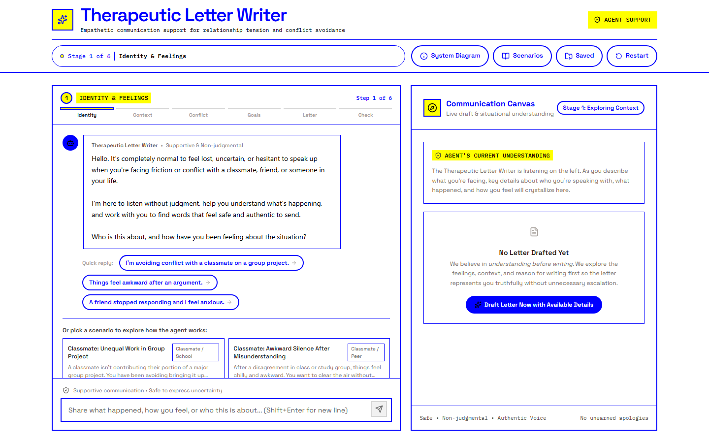

# Therapeutic Letter Writer

Therapeutic Letter Writer is an AI-assisted communication prototype for people who feel stuck, anxious, or unsure about addressing tension with someone in their life. It helps a user slow down, describe what happened, identify what they need, and turn those thoughts into a calm, respectful letter or message.

**[Try the live prototype](https://therapeutic-letter-writing-agent.vercel.app/)**

> **Prototype notice:** This is an exploratory class and portfolio project, not a therapy service or a finished product. It should not be used as a substitute for professional mental-health support, crisis help, legal advice, or personal judgment.

## Who it is for

The prototype is designed for someone who wants help finding words during an uncomfortable conversation—for example, a classmate dealing with unequal group work, roommates discussing shared-space boundaries, friends reconnecting after distance, or partners trying to repair a disagreement.

It may be especially useful when the user knows something needs to be said but is worried about sounding hostile, apologizing for a reasonable boundary, or making the conflict worse.

## How to use it

No installation is needed to try the public version.

1. Open the **[live site](https://therapeutic-letter-writing-agent.vercel.app/)**.
2. Tell the assistant who the message is for and how the situation feels. You can type your own situation, tap a suggested reply, or choose one of the sample **Scenarios**.
3. Answer the assistant's questions about what happened, what outcome you want, and any boundaries that should be respected.
4. Continue through the guided conversation, or select **Draft Letter Now with Available Details** when you are ready.
5. Review the result in the **Letter Canvas**. The other tabs explain how the message may be received and what communication choices the draft uses.
6. Adjust the result by asking the AI to make it warmer, firmer, shorter, or less defensive. You can also select **Edit Directly** and change the wording yourself.
7. Use **Copy**, **Save**, **Download**, or **Print** when the draft feels right. Printing also provides the browser's option to save a PDF.

The app never sends the letter to its recipient. The user decides what to keep, change, and share.

## How it works

The experience follows six stages:

1. **Identity and feelings:** Who the message is for and how the user feels.
2. **Events and context:** What happened, including the details that led to the tension.
3. **Root cause:** What may be underneath the conflict, without treating assumptions as facts.
4. **Goals and boundaries:** What the user wants to communicate, protect, or change.
5. **Letter drafting:** A complete personal letter by default, or another format such as an email or text when requested.
6. **Review and revision:** Changes to tone, length, clarity, and boundaries based on the user's feedback.

In plain language, the website keeps track of the details the user shares and sends the conversation to a small server. That server gives Google Gemini a set of communication guidelines and asks it to return a structured response. The app then displays the AI's next question, its current understanding, and—when enough information is available—a draft.

The AI is instructed to:

- Separate events, feelings, and assumptions.
- Use grounded “I” statements instead of accusations.
- Preserve boundaries without adding hostility.
- Avoid apologies the user did not intend to make.
- Explain the strategy behind the draft.
- Suggest how the message *might* be received.

The user remains in control: they can skip ahead to a draft, revise the AI's wording, edit the letter manually, or start over.

## Where the AI falls short

AI-generated communication can sound confident even when it has misunderstood the situation. Users should treat every response as a draft, not as an expert conclusion.

- The AI can miss context, oversimplify a relationship, use generic language, or introduce an inaccurate detail.
- Its description of how a recipient may react is only a possibility. It cannot know another person's thoughts or predict their behavior.
- It cannot decide who is right, diagnose either person, or determine whether a relationship is safe.
- It is not designed for emergencies, abuse intervention, or crisis support.
- Sensitive details typed into the conversation are sent to Google Gemini so the AI can respond. Users should avoid entering information they would not want processed by an outside AI service.
- The quality of a draft depends on the quality and completeness of the information provided.

For an important or high-risk conversation, the user should review the wording carefully and consider getting help from a trusted person or qualified professional.

## Saving and privacy

Saved letters stay in the current browser's local storage. There is no user account or cloud archive. As a result:

- Saved drafts do not automatically appear on another device or browser.
- Clearing browser data may remove saved drafts.
- The app does not send a finished letter, email, or text on the user's behalf.

## Tools used

- **React and TypeScript** build the interactive interface.
- **Vite** prepares the website for development and deployment.
- **Tailwind CSS** provides the visual styling and responsive layout.
- **Motion** adds interface animation, and **Lucide** provides icons.
- **Express** handles requests between the website and the AI service.
- **Google Gemini**, through Google's Gen AI SDK, generates questions, structured context, drafts, and revisions.
- **Browser local storage** keeps saved drafts on the user's device.
- **Vercel** hosts the public website and its server-side AI endpoints.
- **OpenAI Codex** helps inspect the project, draft and revise code and documentation, and check changes during development.

## What is unfinished

This prototype demonstrates the central conversation-to-letter experience, but it is not production-ready. Important unfinished work includes:

- User accounts, cloud saving, and cross-device access.
- Draft history, undo, and comparison between revisions.
- A way to send a finished message directly from the app.
- Stronger privacy controls and clearer data-retention information.
- Dedicated crisis, abuse, and high-risk-situation detection and guidance.
- Formal accessibility, usability, and safety testing with a wider range of users.
- Professional or clinical review of the communication guidance.
- More robust handling of AI outages, incorrect responses, and unusual situations.

These gaps are intentional signs of the project's current stage: it is a prototype for exploring how a guided AI conversation might help someone communicate more thoughtfully while keeping final judgment in human hands.
